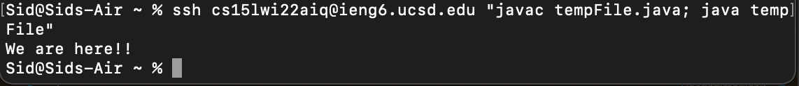

# Lab Report 1 (Week 2)

> ## **Installing Visual Studio Code (VS Code)**

1. The first step is to download Visual Studio Code by going to this link: [Visual Studio Code Download Page](https://code.visualstudio.com/)

    Once you open the page you will need to click this button:

    

2.  Clicking the **Download** button will take you to a page that shows the various machines for which you can download VS Code (as shown below)

    

3.  Choose your machine type, and download the software

4.  Open the package that is downloaded and execute the installation procedure

5.  Once everything is installed, a landing page will come up (as shown below)

    

From here a new file can be created by clicking **New File...** or an existing project can be opened by clicking **Open...**

Once you have created a new file or opened a project, you are all set and ready to go!
 
 
 

> ## **Remotely Connecting**
An important part of this class is being able to connect to a remote server. Follow the steps below to gain server access with your account.
 

1. The first thing that you need to do is find your account in the UCSD server using this link: [Server Search Link](https://sdacs.ucsd.edu/~icc/index.php)

2. Once you find your account you need to remember the username characters that correspond to you. Then create a password for your account.

3. Once you've done that you will open your terminal as shown below:  

    

4. Once you are in your terminal you will paste the following command into your command line:  

    `ssh cs15lwi22zz@ieng6.ucsd.edu` (replace `zz` with your username)  
You will be prompted to input your password and once you do so you will be logged into the server and the following data should be shown: 

    

5. Now we can execute commands on the server, as will be outlined in the next section.

 
 
 

> ## **Executing Commands**
We will be covering the:  
- `ls`  
- `ls -a`  
- `cd`  
- `pwd`  
- `mkdir`  

**`ls`:**  
This command will show you all the files and folders of the directory you are currently in.  

 
 

**`ls -a`:**  
This command will show you all the files and folders (including all hidden files) of the directory you are currently in.  

 
 

**`cd`:**  
This command will change the directory you are in. It is executed by writing `cd <new directory>`  

 
 

**`pwd`:**  
This command will print the directory you are currently in. This is very useful if you ever lose track of what folder you are in and how you got there.  

 
 

**`mkdir`:**  
The `mkdir` command is the make directory command, and when executed it will create a new folder in the directory you are currently in. It is executed by typing  
`mkdir <new folder name>`  

 
 
 

> ## **Moving files over SSH using SCP (local to remote)**
The `scp` command (which is always run from your local machine) will take a file you specify and will transfer it to the remote location of your choice.

In order to execute the `scp` command follow the steps outlined below:

1. Create a new file on your local computer  

    

2. Write some java code in your file   

    

3. Execute the scp command  

    

    Now you will see that 100% of the file has been transferred over to the remote server

    If you log into the remote server you should see the file has been copied.

    

    And if you compile and run the file, it should run properly on the server.  

    

    You have successfully transferred files from your local machine to the server!

 
 
 

> ## **Setting up an SSH Key**

While it is possible to type in the user name and password for the server every time you need to access it, it is very incovenient, especially when you need to log in multiple times over the course of an assignment

A much faster way is using an SSH key which essentially auto logs you in.

1. Generate a public and private key pair using the `ssh-keygen` command. You will then be prompted to input the location where you want to save the files (it is okay to use the default location they give you).

    

2. Then you need to log into the server using  
 `ssh cs15lwi22zz@ieng6.ucsd.edu`  

    Then you will execute the command `mkdir .ssh` which will create an ssh directory on the server 

3. You will log out of the server using the `exit` command

4. Finally, you will transfer one of the keys over to the server using `scp` 

    In order to do so you need to type in the following command:
    
    `scp /Users/YOUR_SSH_LOCATION/.ssh/id_rsa.pub cs15lwi22@ieng6.ucsd.edu:~/.ssh/authorized_keys`

5. Once this is done you will be able to login without having to input your password as shown below:  

    

 
 
 

> ## **Optimizing Remote Running**

We will be covering 2 different ways to optimize running.

1. Using arrow keys to run previous commands  
    By running a command, and then using the arrow keys (up for previous, down for next), you will be able to see what commands you've run previously and press the **enter** key to run them again

2. The second method is to run short commands inline without having to wait to log into the server.

    One such command is `ssh cs15lwi22zz@ieng6.ucsd.edu "ls"`

    This will show this in the terminal

      

    As you can see we are not logged in, we simply accessed the server, and printed the data. This saves time as we do not need to log into and out of the server just to check something small

    We can also execute programs using this inline method.  

    `ssh cs15lwi22zz@ieng6.ucsd.edu "javac FILE.java; java FILE"`  

    Which will give the result shown below:  

      

These two methods can allow us to easily execute commands that we've already done such as compiling and running, and can allow us to execute commands on the server without having to log in and out.

