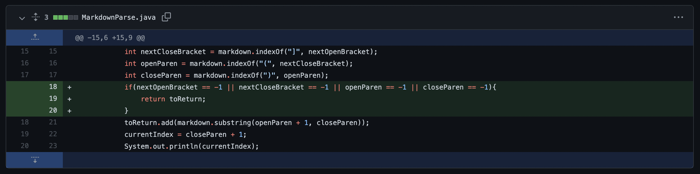
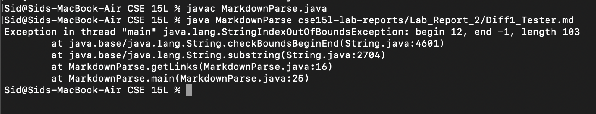
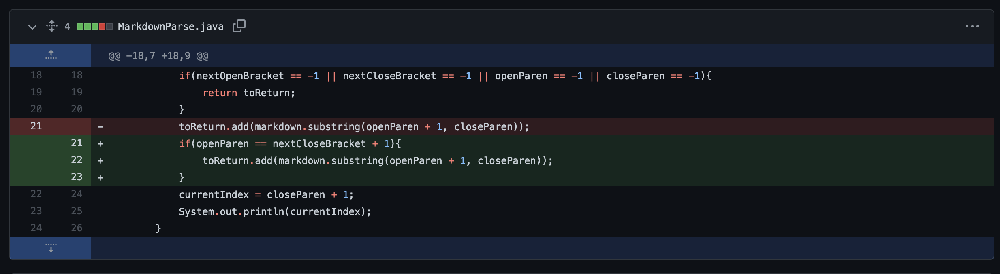
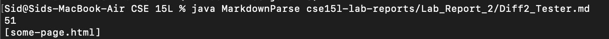
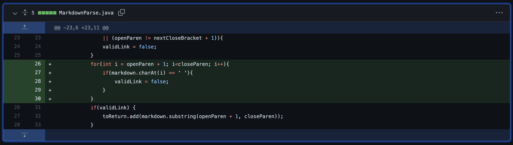
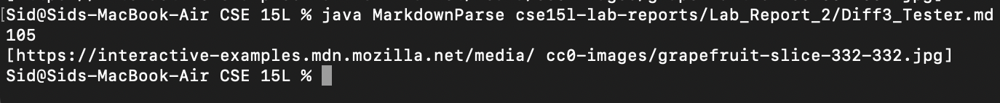

# Lab Report 2 (Week 4)

> ## **First Bug Fix**

**Updated Diff Code**
 
 

**The file (failure inducing input) that breaks the original version of this code**

[Diff1_File](Lab_Report_2/Diff1_Tester.md)

 

**Symptom of the failure inducing input**
 
 

 
 

**Relationship between the bug, symptom, and error inducing input**

The error inducing input was an invalid link because it didn't have a closing parenthesis. The bug in this case was that the code didn't have a check for invalid opening and closing parenthesis/bracket. The symptom was that the link would be read as a valid link even though it wasn't. This was easily remedied by adding a conditional to the code which checks to see if the opening/closing bracket/parenthesis location is at index -1, which means that it wasn't found. This bug fix, fixed the symptom and resulted in no link being read.

 
 
 
 

> ## **Second Bug Fix**

**Updated Diff Code**
 
 

**The file (failure inducing input) that breaks the original version of this code**

[Diff2_File](Lab_Report_2/Diff2_Tester.md)

 

**Symptom of the failure inducing input**
 
 

 
 

**Relationship between the bug, symptom, and error inducing input**

The error inducing input was an invalid link because there was text between the link header and the actual link. The bug in this case was that the code didn't have a check to see if the header and link were consecutively written. The symptom was that the link would be read as a valid link even though it wasn't. This was easily remedied by adding a conditional to the code which checks to see if the index of the closing bracket is one less than the index of the opening parenthesis, which means that they are next to each other. This bug fix, fixed the symptom and resulted in no link being read.

 
 
 
 

> ## **Third Bug Fix**

**Updated Diff Code**
 
 

**The file (failure inducing input) that breaks the original version of this code**

[Diff3_File](Lab_Report_2/Diff3_Tester.md)

 

**Symptom of the failure inducing input**
 
 

 
 

**Relationship between the bug, symptom, and error inducing input**

The error inducing input was an invalid link because there was a space in the link url. The bug in this case was that the code didn't have a check to see if the link was continuous with no spaces. The symptom was that the link would be read as a valid link even though it wasn't. This was easily remedied by adding a conditional to the code which checks to see if the character at a specific index is a space, and if there is a space then that renders the link invalid. This bug fix, fixed the symptom and resulted in no link being read.