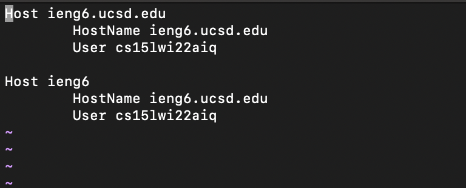
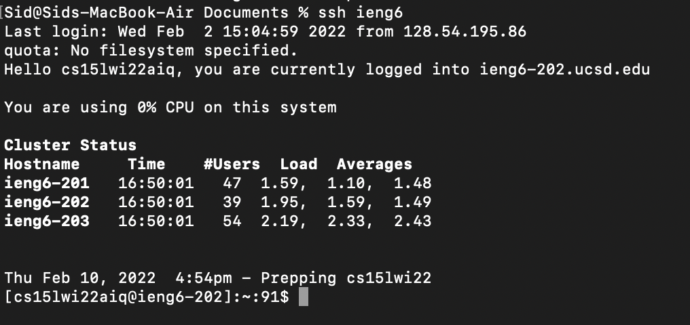
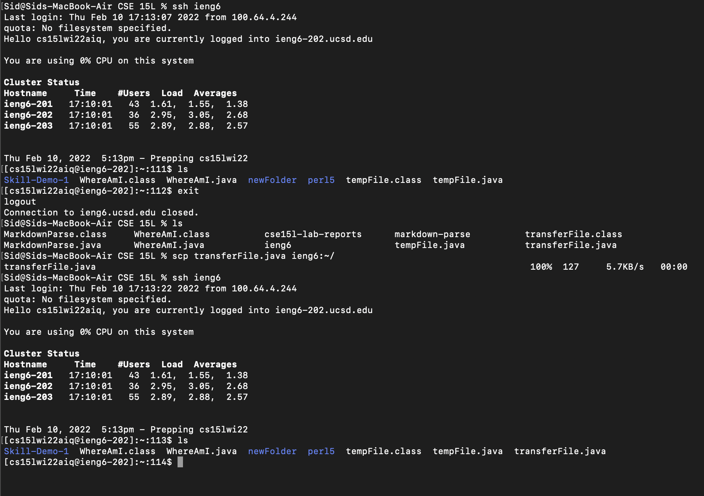

# Lab Report 3 (Week 6)

> ## **Streamlining SSH config**
 
 

**Creating a new SSH alias that will help speed up the login process**
 
 

In the image above, I have access the `.ssh/config` file, which has given me the ability to create my own `ssh` alias, which I can link to my `ieng6.ucsd.edu` account in order to speed up my login process.
 
 
 
 

> ## **SSH Login with Alias**

**Using the new SSH Alias to speed up the login process**
 
 

In the image above, I used the new `ssh` alias to log into my `ieng6.ucsd.edu` account without having to enter my username and password. This has shortened my login procedure to only 9 keystrokes.

 
 
 
 

> ## **Using SCP with new SSH Alias**

**Using the SCP command to copy files over to the server with the SSH Alias**
 
 

In the image above, I am using the new `ssh` alias and the `scp` command to copy a file from my local desktop to the server. The file I am transferring is called `transferFile.java`. The image shows the server before the file transfer, and it can be seen that `transferFile.java` does not exist. After logging out and executing the transfer, I logged back in and now `transferFile.java` is in the server.