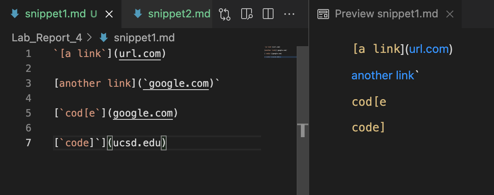
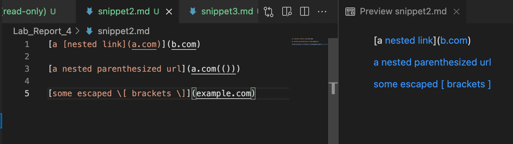
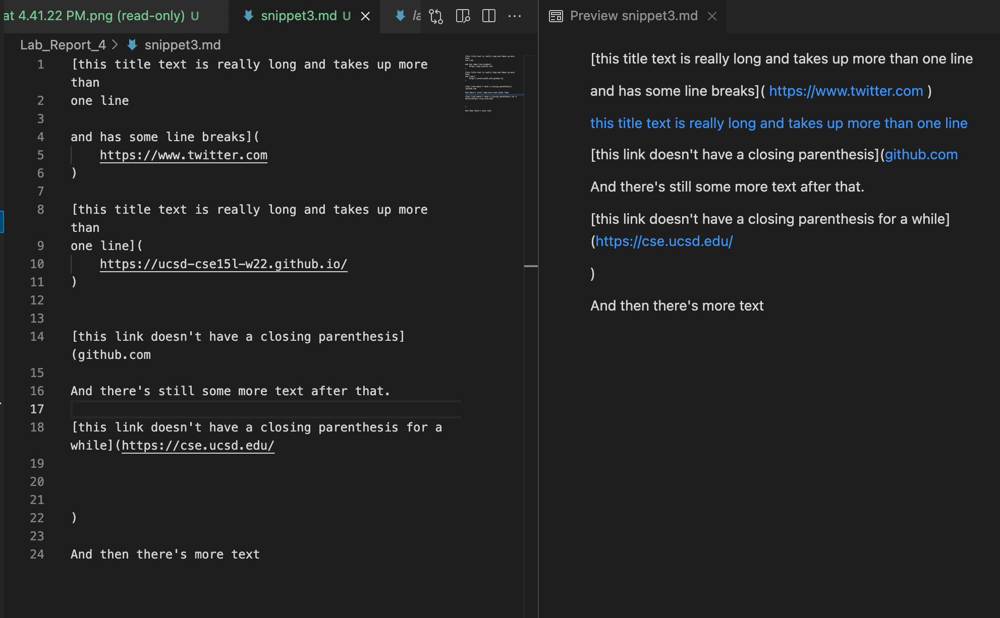
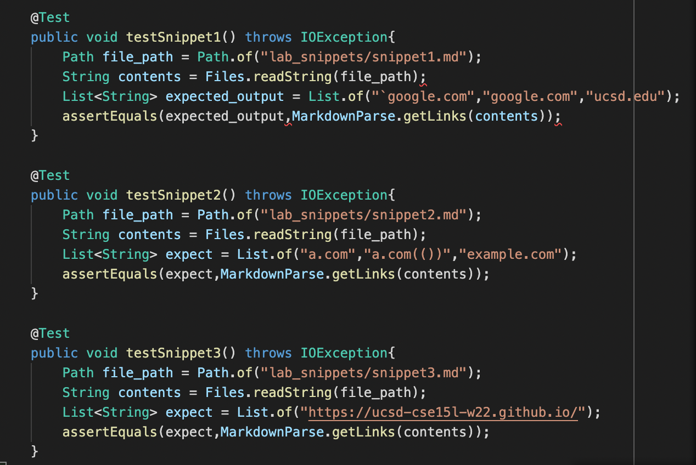
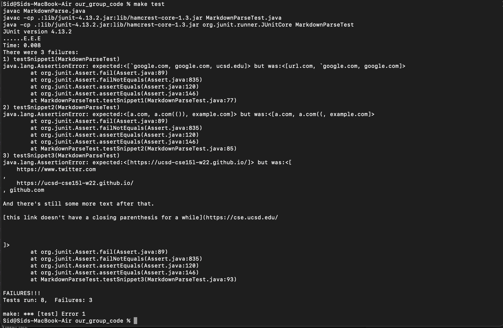
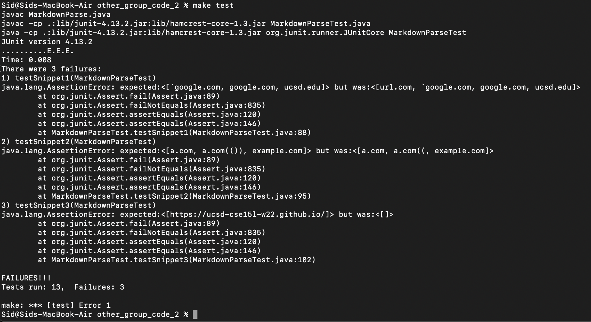

# Lab Report 4 (Week 8)

> ## **Links to Repos**

**My group's repository**

[Repo](https://github.com/JessalynWang/markdown-parse)

**Other group's repository**

[Repo](https://github.com/garrett-lam/markdown-parse)
 
 

> ## **Visual Studio Markdown Preview**

**Snippet 1**

**Snippet 2**

**Snippet 3**

 
 

For each of these snippets, I was able to add relevant test cases for both our own code, and the code of the other group. The code for the tests was the same, and is shown in the image below:

 
 

> ## **My group's JUnit Test**
 
 
When running our code using the three new JUnit tests for code snippet 1, 2, and 3, the code failed all three of the tests.

 
 

> ## **Other group's JUnit Test**
 
 
When running the other group's code using the three new JUnit tests for code snippet 1, 2, and 3, the code failed all three of the tests.

 
 

> ## **Questions about code changes**

1. I think that there is a short change that we can make to check the backticks within the link. We can see whether a link is valid or not, by checking to see if there are any backticks before the `nextOpenBracket` location. If there are any, then the link is not valid. This would be one or two if-statements, and would not take more than 10 lines of code.

2. I do not think that there is any small change that can be made to account for nested or escaped brackets or parenthesis. The only way I could see such a change being executed is through an extensive check of bracket pairings, which will require multiple loops, and if-statements. The loop and if-statements will need to checke whether a bracket is valid, by ensuring that is isn't nested, and it is paired with a closing/opening bracket. The data storage for such a task will require more than 10 lines of code, and thus this is not a short change.

3. I do not think there is a short change that can be made to implement multi-line brackets and parentheses. We need to check to see how many `\n`'s exist and whether there exists a closing bracket/parenthesis at the end of the line. Such code will require a while loop (we do not know how many new lines there will be), and there might be instances where there is no closing bracket. This instance will require more checks to make sure that we do not reach the end of the file while looping through. Overall the logic for such a check will take longer than 10 lines, and isn't a short change.