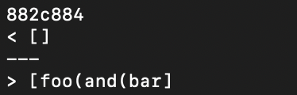

# Lab Report 5 (Week 10)

> ## **How to find tests with differences**

 
 

In order to find the diff between the reults of the two markdown-parse versions we have, we need to run the tests on all of the `.md` files and save the data into a `.txt` file that we can access later.

In order to do this, we first add a line to the `script.sh` file that will output the name of the file we are testing. 

This file will iterate through each of the `.md` files within the `test-files` directory. It will print out the name of the file, execute the `java MarkdownParse` command with the name of the file as the argument.

The updated file is as shown below:

 
 

 
 

We will then run the file and use output redirection to store the results of the run into a file of our choosing

The command that was run looks like this:

 
 

 
 

This was executed within both the directory that contained my groups markdown-parse and the version of markdown-parse we were given.

Now that we have two files that contain the results of the respective implementations, we can use the `diff` command to see what the differences are between their outputs.

 
 

 
 

The `diff markdown-parse/result.txt our_group_code/result.txt  `gives us the lines within each `result.txt` that has a different output. We can see that line 92, 212, 230, and so on have different outputs. In order to find out what tests are being run, we can open one of the `result.txt` files and see what line number corresponds to what test

 
 

> ## **Checking two different bugs**

 
 

## **Bug 1**

The first bug that I will be testing is shown in the diff below:

 
 

 
 

This test corresponds to the `481.md` file and expected value for this `.md` file is (which shows that a valid link was found):

 
 

 
 

For this example, the `markdown-parse` gives us an empty list which means it found no valid link, and that is **incorrect**. Our groups code returned the **correct** parsing of the `.md` file.

 
 

### **Issue for Bug 1**

Because `markdown-parse` gave us the wrong result, we will be focusing on its `MarkdownParse.java` file.

The relevant `getLinks()` method is shown below:

 
 

 
 

The subsection of this method that is resulting in the error in the parse is shown below:

 
 

 
 

The issue here is that it is assumed that no link will have a space in it. With this definition every link that has a space is ignored. However, this assumption is wrong, which results in certain files being ignored.

One way to fix this issue is to eliminate the space check from the conditional statement. In doing this, we will allow spaces, and the file should parse correctly.

 
 

## **Bug 2**

The second bug that I will be testing is shown in the diff below:

 
 

 
 

This test corresponds to the `496.md` file and expected value for this `.md` file is (which shows that a valid link was **not** found):

 
 

 
 

For this example, the `markdown-parse` gives us an empty list which means it found no valid link, and that is **correct**. Our groups code returned the **incorrect** parsing of the `.md` file.

 
 

### **Issue for Bug 2**

Because our group's code gave us the wrong result, we will be focusing on its `MarkdownParse.java` file.

The relevant part of the code is shown below:

 
 

 
 

The issue here is that there are nested parenthesis within the markdown, which renders the link invalid.

One way to fix this issue is to have a `parenthesisTracker` stack, and we can push and pop according to whether we encounter a `)` or `(`. If the tracker already has a parenthesis in it, then the link is invalid because that implies that we have a nested structure.